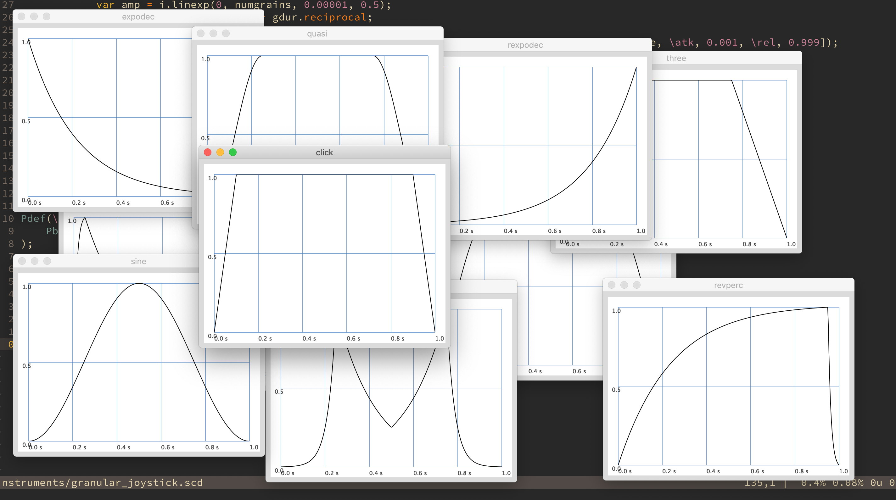

# Particular

A SuperCollider package for particle synthesis. 

This is an old SuperCollider trick that lets you create granular synthesis on a per-particle basis. This package is just a way to do that more easily.

See the helpfile for examples

### Installation

In SuperCollider, evaluate the following code to install it as a quark:
`Quarks.install("https://github.com/madskjeldgaard/Particular.git");`
